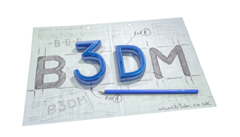

# Batched 3D Model

> Taken from [AnalyticalGraphicsInc/3d-tiles/TileFormats/Batched3DModel/README.md](https://github.com/AnalyticalGraphicsInc/3d-tiles/blob/master/TileFormats/Batched3DModel/README.md)

Batched 3D Model allows offline batching of heterogeneous 3D models, such as different buildings in a city, for efficient streaming to a web client for rendering and interaction. Efficiency comes from transferring multiple models in a single request and rendering them in the least number of WebGL draw calls necessary. Using the core 3D Tiles spec language, each model is a feature.
 
Per-model properties, such as IDs, enable individual models to be identified and updated at runtime, e.g., show/hide, highlight color, etc. Properties may be used, for example, to query a web service to access metadata, such as passing a building's ID to get its address. Or a property might be referenced on-the-fly for changing a model's appearance, e.g., changing highlight color based on a property value.
 
A tile is composed of two sections: a **header** immediately followed by a **body**, i.e. Binary glTF. The body section immediately follows the header section, and is composed of two fields: *Batch Table* and *Binary glTF*.

## Header

|Field name|Data type|Description|
|:-:|:-:|:-:|
|magic|4-byte ANSI string|"b3dm". This can be used to identify the arraybuffer as a Batched 3D Model tile.|
|version|uint32|The version of the Batched 3D Model format. It is currently 1.|
|byteLength|uint32|The length of the entire tile, including the header, in bytes.|
|batchTableJSONByteLength|uint32|The length of the batch table JSON section in bytes. Zero indicates there is no batch table.|
|batchTableBinaryByteLength|uint32|The length of the batch table binary section in bytes. If batchTableJSONByteLength is zero, this will also be zero.|
|batchLength|uint32|The number of models, also called features, in the batch.|

## Body

### Batch

The Batch Table contains per-model application-specific metadata, indexable by batchId, that can be used for declarative styling and application-specific use cases such as populating a UI or issuing a REST API request. In the Binary glTF section, each vertex has an numeric batchId attribute in the integer range [0, number of models in the batch - 1]. The batchId indicates the model to which the vertex belongs. This allows models to be batched together and still be identifiable.
 
See the [Batch Table](https://github.com/AnalyticalGraphicsInc/3d-tiles/blob/master/TileFormats/BatchTable/README.md) reference for more information.

### Binary glTF

**[glTF](gltf.md)** is the runtime asset format for WebGL. [Binary glTF](https://github.com/KhronosGroup/glTF/tree/master/extensions/Khronos/KHR_binary_glTF=) is an extension defining a binary container for glTF. Batched 3D Model uses glTF 1.0 with the [KHR_binary_glTF](https://github.com/KhronosGroup/glTF/tree/master/extensions/Khronos/KHR_binary_glTF) extension.
 
Binary glTF immediately follows the batch table. It begins 20 + batchTableByteLength bytes from the start of the arraybuffer and continues for the rest of arraybuffer. It may embed all of its geometry, texture, and animations, or it may refer to external sources for some or all of these data.
 
The glTF asset must be 8-byte aligned so that glTF's byte-alignment guarantees are met. This can be done by padding the Batch Table if it is present.

