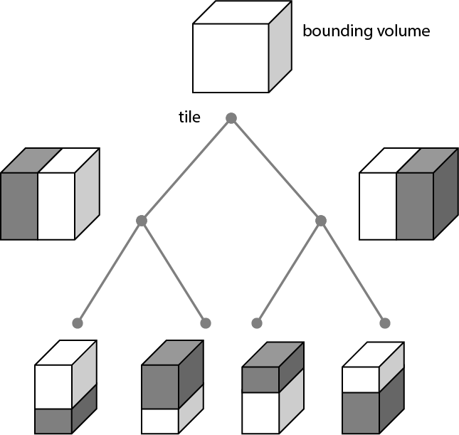

##Visualization
In this section, we will describe the process and different parameters used in the visualization of 3d vector tiles.
###Itowns
Oslandia had announced the first release of iTowns, a new 3D geospatial data visualization web framework developed by the iTowns project, including people from French IGN, Oslandia and AtolCD .

iTowns is a web framework written in Javascript/WebGL for visualisation of 3D geographic data, allowing precise measurements in 3D. Its first purpose is the visualisation of street view images and terrestrial lidar point clouds, though it now supports much more data types.

####Technical basis :

- JavaScript
- WebGL
- THREE.JS
- Shaders

→ iTowns : client-side only

Oslandia is working on iTowns to support the GLTF format for 3d data display. Itowns uses a Javascript 3d library called THREE.JS which serves to load glTF format.

###Tileset 
> Taken from: [Tileset](https://github.com/AnalyticalGraphicsInc/3d-tiles/blob/master/README.md) 

A tileset is a set of tiles organized in a spatial data structure, the tree. Each tile has a bounding volume completely enclosing its contents. The tree has spatial coherence; the content for child tiles are completely inside the parent's bounding volume. To allow flexibility, the tree can be any spatial data structure with spatial coherence, including k-d trees, quadtrees, octrees, and grids.

### LOD
In client side, Level of detail involves decreasing the complexity of a 3D model representation as it moves away from the viewer or according to other metrics such as object importance, viewpoint-relative speed or position. Level of detail techniques increase the efficiency of rendering by decreasing the workload on graphics pipeline stages, usually vertex transformations.

| Level Of Details | LOD 01 | LOD 02 | LOD 03 | LOD 04 |
| ---- | : ---- : | :-----:| :----: | :----: |
|**Tile structures**| 3D Building | + Roofing  | + Texture | + 3D Object |
| **Required Data** | 2D frame contour | LOD 01 + Orthophoto HD| LOD 02 + oblique pictures + Detail of facades | LOD 03 + Architect Plans + Field surveys |
| **Optional Data** | Textured DMT | Textured DMT | Textured DMT + Breaking lines | Textured DMT + Breaking lines |
| **Applications** | *Departement*: * 3D simple * Map of the noises - Flood Map | *Agglomeration* Facilities - Modelization - Simulation | City - Urbanism - Communication - Tourism | City Heart - Immersion - Networks - Security |

###Process 
When the user launches iTowns, The view is initialized by a global tileset.
The zoom level determines a bounding box of a tileset.

Each tileset is characterized by an identifier which is included in the request with the level of detail LOD. 

The response to the request is a 3dtiles format which contains a gltf file that is required for display and can be loaded using the three.js library: [GLTFLoader.js](https://github.com/mrdoob/three.js/blob/dev/examples/js/loaders/GLTFLoader.js)

The cache contains a copy of the original data when it is expensive to retrieve compared to cache access time. Once some 3d vector tiles are stored in the cache, the client can access them directly through the cache rather than retrieving them by requests, which reduces the access time.

