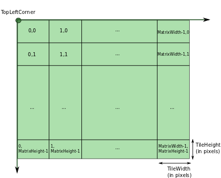

http://www.arcorama.fr/2016/03/tirer-profit-de-la-puissance-des-tuiles.html
Un article qui rapelle certaines principes généraux du tuilage, et de sa mise à disposition via le service ArcGis Server. Il montre aussi comment un utilisateur peut choisir dynamiquement les données affichées au moyen d'un script JSON.

http://docs.opengeospatial.org/is/13-082r2/13-082r2.html
Spécifications de l'Open Geospatial Consortium quant au WMS, faisant office d'autorité.

http://wiki.openstreetmap.org/wiki/GDAL2Tiles
Détail de la fonction de GDAL qui permet de transformer une couche géoréférencée en service de cartographie tuilée.

http://geotribu.net/node/41
Article expliquant comment mettre en place un cache entre le serveur et le client, pour garder en mémoire les tuiles déjà affichées.

--------------------------------------------------

##PRINCIPE DES TUILES VECTORIELLES

Le tuilage a pour principe de subdiviser toute la surface d'une carte en petite dalles. Dans le cadre de notre projet, ces dalles vont donc contenir des couches d'information vectorielle i.e. des descriptions géométriques de points, lignes, et surfaces (pour ce qui est de l'emprise bâtiments surtout). Ces tuiles doivent ensuite être stockées pour être accessibles à distance par un client relié au web. La division se fait généralement selon un principe de pyramidage (voir schéma ci-dessous). Elle peut être réalisée avec différents outils de SIG tels que ArcGis () ou grâce à la bibliothèque GDAL (fonction gdal2tiles). Le tuilage permet deux avantages principaux : 

- n'afficher à l'écran que les tuiles nécessaires — et non la totalité de la carte d'un seul coup — pour limiter le nombre d'entités à afficher et ainsi gagner en performance dans l'affichage. Il est aussi possible d'intégrer un cache (TileCache) entre le serveur et le client, qui permette de garder en mémoire les dalles déjà générées, pour le rendre disponible bien plus rapidement si l'utilisateur les sollicite de nouveau.

- le niveau  de généralisation des informations est aussi adaptable au niveau de zoom sur la carte, autrement dit : plus on zoome, plus les informations vectorielles sont détaillées, et inversement. Cela implique toutefois qu'un tuilage ait été préparé pour chaque niveau de zoom.

 

######Division d'une couche en tuiles (blog.martzuff.net)  

  
A chaque niveau de zoom, correspond un découpage en tuiles. Ces découpages doivent être définis dans une matrice des tuiles. Cette matrice inventorie l'ensemble des tuiles au niveau de zoom donné, avec leurs emprises respectives. C'est elle qui est interrogée par pour renvoyer les dalles correspondant à l'emprise de la requête.   

 

###### Schématisation d'une matrice des tuiles (source: api.ign.fr)

  

## LE WMTS (Web Map Tile Service)

Le WMTS est, de la même manière que WMS, un moyen de transmettre de l'information géographique, suivant certains standards fixés par l'OGC (Open Geospatial Consortium). Les données peuvent ainsi être transmises  selon de normes qui pourront ainsi être interprétables par toute une série de clients. La différence repose ici sur l'utilisation d'un tuilage  prédéfini par le concepteur de la carte, qui sert d'unité de surface pour la diffusion des données, selon le niveau de zoom.
Ce standard supporte 3 types de requêtes :

- GetCapabilities : pour obtenir des méta-données sur le service et les possibilités qu'il offre.

- GetFeatureInfo : qui permet d'interroger le serveur pour obtenir des informations sur une entité précise contenue dans la carte.

- GetTile : qui permet de renvoyer les tuiles à afficher. 

Ces fonctions acceptent un certain nombre de paramètres, qui doivent figurer dans l'url de la requête qui est transmise au serveur. Il s'avèrent nécessaires à plus forte raison pour les requêtes de type GetTile puisqu'ils définissent l'emprise et le niveau zoom pour renvoyer l'ensemble de tuiles adéquat. 

Parmi ces paramètres : 

- le nom du service qui fournit les données et sa version
- la couche d'information que l'on souhaite récupérer
- le style d'affichage
- le format des données que l'on veut obtenir
- la matrice des tuiles à interroger (correspondant au niveau de zoom)

Pour les requêtes de type GetFeatureInfo, il faut également renseigner les coordonnées de l'élément visé. 
